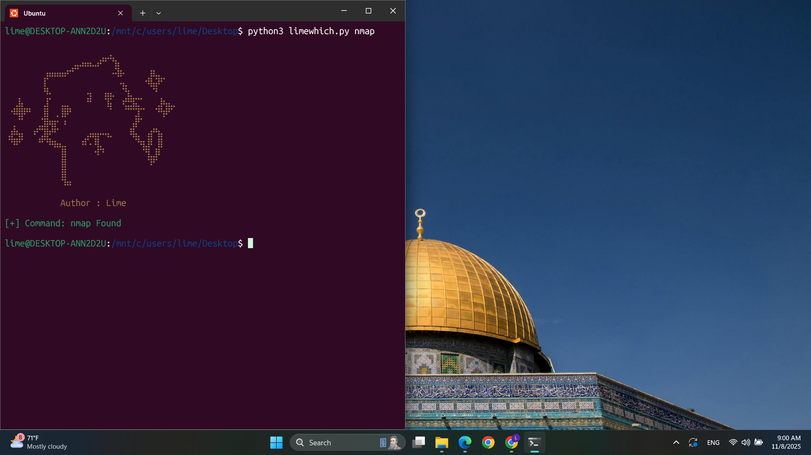
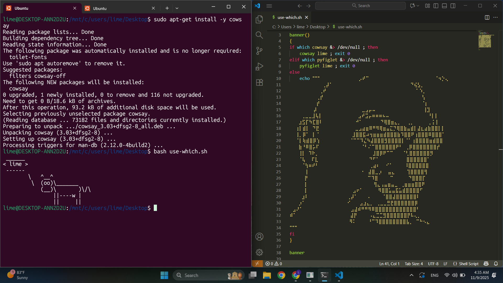

# limewhich🐱


عندما شاهدت كيف تعمل أداة which في أنظمة التشغيل، تساءلت بيني وبين نفسي: ما الآلية التي تتبعها هذه الأداة لتعرف ما إذا كانت أداة معينة مثبتة في النظام أم لا؟
خطر ببالي أن الفكرة ربما تعتمد على البحث داخل مجلدات الـ binaries (bin) الموجودة في النظام.

من هنا بدأت التجربة، ونجحت فعليًا في محاكاة فكرة الأداة من خلال إنشاء أداة تقوم بفحص وجود الأدوات في النظام عن طريق تحليل متغير البيئة PATH الذي يحتوي على مسارات مجلدات الـ binaries.
هذه الأداة تساعدك على فهم إحدى الطرق التي يمكن للنظام من خلالها البحث عن الأدوات المثبتة، مع التأكيد أن البحث داخل مجلدات الـ bin هو طريقة واحدة فقط من بين عدة طرق يمكن للنظام أن يعتمدها لتنفيذ نفس المهمة.


## مثال


## التحميل والتشغيل :
```
git clone https://github.com/limeeee48/limewhich.git
cd limewhich
python3 limewhich.py
```
## من فوائد الأداة🎯 : 


* التعامل مع متغير البيئة PATH وفهم كيف النظام ببحث داخل مجلدات الـ binaries عن الأدوات.

* التعرّف على الـ Exit Codes عمليًا، وفهم كيف يمكن استخدامها للإشارة إلى نجاح أو فشل العملية.

* لأن الأداة تعمل باستخدام Exit Codes، يمكنك دمجها داخل سكربتات Bash للتحقق من وجود أدوات معينة،
فبدل ما يظهر خطأ غير مفهوم في حال عدم وجود الأداة، يمكنك معالجة الحالة بنفسك — مثل عرض رسالة مخصصة أو استخدام أداة بديلة.
.
## مثال على فحص وجود الأدوات لتجنب الأخطاء :

## الكود للتجريب :
```
#!/usr/bin/bash

banner()
{
if which cowsay &> /dev/null ; then
	cowsay lime ; exit 0
elif which pyfiglet &> /dev/null ; then
	pyfiglet lime ; exit 0
else
	echo """⠀⠀⠀⠀⠀⠀
⠀⠀⠀⠀⠀⠀⠀⠀⠀⠀⠀⢀⡼⠁⠀⠀⠀⠀⠀⠀⠀⠀⠀⠀⠀⠀⠀⠀⠀⠀⠀⠀⠀⠀⠀⠀⠀⠀⠀⠀⠙⢮⣣⡀⠀⠀⠀
⠀⠀⠀⠀⠀⠀⠀⠀⠀⠀⢀⠞⠀⠀⠀⠀⠀⠀⠀⠀⠀⠀⠀⠀⠀⠀⠀⠀⠀⠀⠀⠀⠀⠀⠀⠀⠀⠀⠀⠀⠀⠀⠁⠱⡀⠀⠀
⠀⠀⠀⠀⠀⠀⠀⠀⠀⢀⡞⠀⠀⠀⠀⠀⠀⠀⠀⠀⠀⠀⠀⠀⠀⠀⠀⠀⠀⠀⠀⠀⠀⠀⠀⠀⠀⠀⠀⠀⠀⠀⠀⠀⢣⠀⠀
⠀⠀⠀⠀⠀⠀⠀⠀⠀⡞⠀⠀⠀⠀⠀⠀⠀⠀⠀⠀⠀⠀⠀⠀⠀⠀⠀⠀⠀⠀⠀⠀⠀⠀⠀⠀⠀⠀⠀⠀⠀⠀⠀⠀⠈⡆⠀
⠀⠀⠀⠀⠀⠀⠀⠀⡼⠀⠀⠀⠀⠀⠀⠀⠀⠀⠀⠀⠀⠀⠀⠀⣀⣠⡤⠤⠀⠀⠀⠀⠀⠀⠀⠀⠀⠀⠀⠀⠀⠀⠀⠀⢸⣹⠀
⠀⠀⠀⠀⢀⣀⣀⣸⢧⡇⠀⠀⠀⠀⠀⠀⠀⠀⠀⠀⠀⠀⣠⠞⣩⡤⠶⠶⠶⠦⠤⠀⠀⠀⠀⠀⠀⠀⠀⠀⠀⠀⠀⠀⠘⡇⡇
⠀⠀⠀⣰⣫⡏⠳⣏⣿⠇⠀⠀⠀⠀⠀⠀⠀⠀⠀⠀⠀⠚⠁⠀⠀⠀⠀⠀⠀⠙⢿⣿⣶⣄⡀⠀⠀⢀⡀⠀⠀⠀⠀⠀⡀⡅⡇
⠀⠀⢰⡇⣾⡇⠀⠙⣟⠀⠀⠀⠀⠀⠀⠀⠀⠀⠀⠀⠀⣀⣠⣴⣶⠿⠛⠻⢿⣶⣤⣍⡙⢿⣿⣷⣤⣾⡇⣼⣆⣴⣷⣿⣿⡇⡇
⠀⠀⢸⡀⡿⠁⠀⡇⠈⠀⠀⠀⠀⠀⠀⠀⠀⠀⠀⠀⣸⣿⣿⣯⠴⢲⣶⣶⣶⣾⣿⣿⣿⣷⠹⣿⣿⠟⢰⣿⣿⣿⠿⣿⣿⣿⠁
⠀⠀⠈⡇⢷⣾⣿⡿⢱⠀⠀⠀⠀⠀⠀⠀⠀⠀⠀⠈⠉⠉⠹⣌⠳⣼⣿⣿⣿⣻⣿⣿⣿⣿⡇⠈⠁⢰⣿⣿⣿⣿⣶⣾⣿⣿⠀
⠀⠀⠀⣷⠘⠿⣿⡥⠏⠀⠀⠀⠀⠀⠀⠀⠀⠀⠀⠀⠀⠀⠀⠈⠃⠌⠉⣿⣿⣿⣿⣿⣿⠟⠃⠀⢀⡿⣿⣿⣿⣿⣿⣿⣿⡞⠀
⠀⠀⠀⢸⡇⠀⠹⠗⡀⠀⠀⠀⠀⠀⠀⠀⠀⠀⠀⠀⠀⠀⠀⠀⠀⠀⠀⣸⣿⡿⠟⠉⠉⠀⠀⠀⠈⢃⣿⣿⣿⣿⣿⣿⡻⠀⠀
⠀⠀⠀⠈⢧⠀⠀⠏⣇⠀⠀⠀⠀⠀⠀⠀⠀⠀⠀⠀⠀⠀⠀⠀⠀⠀⠙⠋⠁⠀⠀⠀⠀⠀⠀⠀⠀⠀⣿⣿⣿⣿⣿⣿⠁⠀⠀
⠀⠀⠀⠀⠈⢳⠶⠞⠃⠀⠀⠀⠀⠀⠀⠀⠀⠀⠀⠀⠀⠀⠀⠀⠀⠀⢀⣴⠆⠀⠀⠊⠁⠀⠀⠀⠀⠸⣿⣿⣿⣿⣿⣿⠀⠀⠀
⠀⠀⠀⠀⠀⢸⠀⠀⠀⠀⠀⠀⠀⠀⠀⠀⠀⠀⠀⠀⠀⠀⠀⠀⠂⠀⣼⣿⣀⡰⠀⠀⣤⣄⠀⠀⠀⠀⢹⣿⣿⣿⣿⢻⠀⠀⠀
⠀⠀⠀⠀⠀⡟⠀⠀⠀⠀⠀⠀⠀⠀⠀⠀⠀⠀⠀⠀⠀⠀⠀⠀⠀⠀⠉⠹⣿⠀⠀⠀⠀⠉⠀⠀⠀⠀⠀⠙⣿⣿⣿⡏⠀⠀⠀
⠀⠀⠀⠀⠀⡇⠀⠀⠀⠀⠀⠀⠀⠀⠀⠀⠀⠀⠀⠀⠀⠀⠀⠀⠀⠀⠀⠀⢻⣄⢠⣤⣶⣤⣀⠀⢀⣶⣶⣶⣿⣿⠟⠀⠀⠀⠀
⠀⠀⠀⠀⠀⡇⠀⠀⠀⠀⠀⠀⠀⠀⠀⠀⠀⠀⠀⠀⠀⣠⠖⠁⠀⠀⠀⠀⠀⠻⣿⣿⣥⣤⣯⣥⣾⣿⣿⣿⣿⠋⠀⠀⠀⠀⠀
⠀⠀⠀⠀⣰⠇⠀⠀⠀⠀⠀⠀⠀⠀⠀⠀⠀⠀⠀⢀⡼⠁⠀⠀⠀⠠⠀⠀⠀⠀⠈⣿⣿⣼⣿⣿⣿⣿⣿⣿⠇⠀⠀⠀⠀⠀⠀
⠀⠀⠀⡰⠁⠀⠀⠀⠀⠀⠀⠀⠀⠀⠀⠀⠀⠀⠀⠊⠀⠀⠀⣠⣰⣄⡀⠀⢀⣀⣀⣛⣟⣿⣿⣿⣿⣿⣿⡿⠀⠀⠀⠀⠀⠀⠀
⠀⣠⠜⠁⠀⠀⠀⠀⠀⠀⠀⠀⠀⠀⠀⠀⠀⠀⠀⠀⣠⣼⠾⠛⠛⠻⠿⣿⣿⣿⣿⣿⣿⣿⣿⣿⣿⣿⣿⠃⠀⠀⠀⠀⠀⠀⠀
⠾⠁⠀⠀⠀⠀⠀⠀⠀⠀⠀⠀⠀⠀⠀⠀⠀⠀⠀⠀⣼⡟⠀⠀⠀⠀⠠⣄⣉⣉⣻⣿⣿⣿⣿⣿⣿⡟⠧⢄⡀⠀⠀⠀⠀⠀⠀
⠀⠀⠀⠀⠀⠀⠀⠀⠀⠀⠀⠀⠀⠀⠀⠀⠀⠀⠀⠀⠻⠅⠀⠀⠀⠀⠘⠉⠹⣿⣿⣿⣿⣿⣿⣿⣿⣧⡀⠀⠉⠓⠢⣄⠀⠀⠀
"""	
fi
}

banner
```
